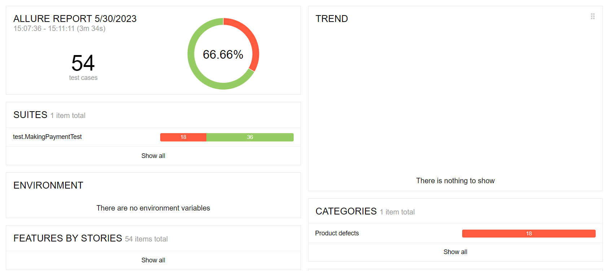

### Краткое описсание:
Дано приложение (веб-сервис) по покупке тура. Приложение имеет собственную СУБД, 
с помощью которой сохраняется информация об успешном или неуспешном осуществлении платежа.
Необходимо проанализировать варианты покупки, описать возможные тест-кейсы, 
покрывающие все элементы приложения, оценить корректность ответа БД на совершение покупки.
Провести автоматизированное тестирование позитивных и негативных сценариев покупки тура.

### Количество тест-кейсов:
Запланировано и описано проведение 54 тест-кейсов. 
Включают в себя тестирование обеих карт с использованием валидных и невалидных данных (спецсимволы, буквенные значения кириллицей).
Применен метод эквивалентных и граничных значений.
Тестированием покрыт как случай простой покупки, так и покупки в кредит.

### Процент успешных и не успешных тест-кейсов:
Согласно тест-кейсам составлены автотесты, 
при запуске тестирования которых 18 завершились с определенными ошибками. 
36 автотестов завершились успешно и соответствовали ожидаемому результату.
По всем негативным тестам зафиксированы баг-репорты.

В процентном соотношении успешные тест-кейсы составили 66%.

### Общие рекоммендации:
1. По полю "Владелец" основными рекоммендациями является утверждение конкретного формата ввода фамилии и имени владельца
(указание образца под полем) на латинском языке.
Ограничение количества вводимых символов и запрет на ввод спецсимволов.
2. Появление предупреждения о некорректном вводе данных до нажатия на кнопку "Продолжить".
3. Выбор срока действия карты из выпадающего календаря (с невозможностью выбора неактуального месяца 
и года). Это позволит избавиться от вариантов некорректного ввода в полях "Месяц" и "Год". 

